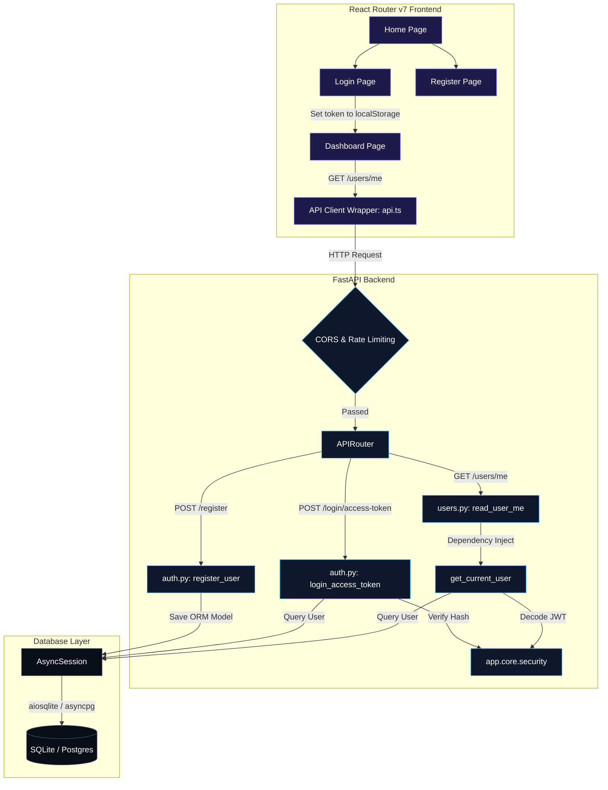
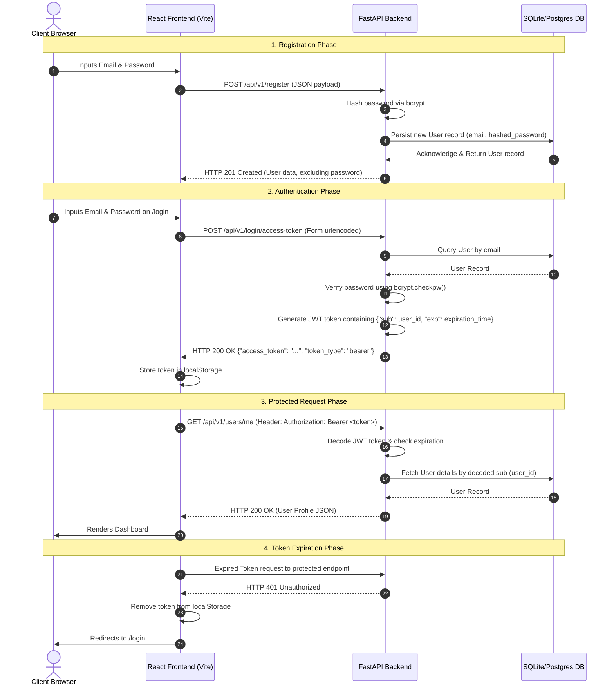

# **Full-Stack Secure API Dashboard Application**

This repository contains a modern, production-ready full-stack application featuring a **Python FastAPI backend** and a **React Router v7 frontend** powered by **Vite** and **Tailwind CSS v4**.

---

## **1. Repository & Architectural Overview**

The codebase is split into two cleanly separated service directories:
```
fullstack-project/
├── BACKEND/                    # Python FastAPI service
│   ├── app/
│   │   ├── api/                # Route definitions & dependency injectors
│   │   ├── core/               # Configuration settings & JWT security helpers
│   │   ├── db/                 # Async database session & engines
│   │   ├── models/             # SQLAlchemy ORM declarative models
│   │   ├── schemas/            # Pydantic validation schemas
│   │   ├── crud/               # Database repository layer
│   │   └── main.py             # FastAPI startup & lifespan hook
│   ├── pyproject.toml          # uv dependency manifest
│   └── requirements.txt        # PIP dependencies fallback
├── FRONTEND/                   # React Router v7 SPA client
│   ├── app/
│   │   ├── routes/             # Routed page views (Home, Login, Register, Dashboard)
│   │   ├── utils/              # API Fetch client wrapper
│   │   ├── root.tsx            # Base React layout shell
│   │   ├── routes.ts           # Central route declarations
│   │   └── app.css             # Main stylesheet (Tailwind v4 imports)
│   ├── package.json            # Node dependency manifest
│   └── vite.config.ts          # Vite build configurations
├── run_backend.sh              # Start backend dev server script
└── run_frontend.sh             # Start frontend dev server script
```

---

## **2. System Architecture Flow**



---

## **3. Authentication Flow & Lifecycle**

The application implements a secure, stateless JWT (JSON Web Token) authentication architecture. Below is the step-by-step breakdown of how credentials, tokens, and requests flow:



### **Authentication Implementation Details**
1. **Password Security**: Passwords are never stored in plain text. During registration (`POST /register`), `bcrypt.hashpw` salts and hashes the password in the worker pool.
2. **Access Token Generation**: Upon successful login (`POST /login/access-token`), the backend generates a JWT token signed with a server-side `SECRET_KEY` and the `HS256` hashing algorithm.
3. **Request Interception**: The frontend wrapper (`api.ts`) automatically intercepts all requests to insert the `Authorization: Bearer <JWT_TOKEN>` header.
4. **Access Verification Dependency**: In `api/deps.py`, `get_current_user` extracts the token, verifies the integrity of the signature via `pyjwt`, verifies the expiration date, and returns the SQLAlchemy model to the route handler.

---

## **3. Backend Architecture (FastAPI)**

The backend service runs a robust, asynchronous API implementing industry-standard security and performance protocols:

### **A. Async Database Configuration (`app/db/session.py`)**
- **Async Engine**: Uses SQLAlchemy `create_async_engine` supporting both PostgreSQL (`asyncpg`) and local SQLite (`aiosqlite`) environments.
- **Connection Checks**: Employs `pool_pre_ping=True` to prevent connection dropout issues.
- **Dependency Injector (`app/api/deps.py`)**: Yields scoped database sessions per request lifecycle ensuring transactional safety.

### **B. Cryptography & Authentication (`app/core/security.py`)**
- **Password Salting**: Employs `bcrypt` to salt and hash user passwords (`get_password_hash` & `verify_password`).
- **JWT Authorization**: Encodes stateful JSON Web Tokens containing the user ID subject (`sub`) and set expiration times using `pyjwt`.
- **Bearer Token Scheme**: Incorporates FastAPI’s `OAuth2PasswordBearer` to extract and validate tokens from incoming HTTP headers securely.

### **C. Operations Guard & Rate Limiting (`app/main.py`)**
- **Rate Limiting**: Incorporates `slowapi` to enforce request limits (e.g. limiting the health check endpoint to `5 requests/minute` and default endpoints to `100/minute`).
- **CORS Protection**: Configured with strict origin checks dynamically mapped from environmental settings.

---

## **4. Frontend Architecture (React Router v7 & Vite)**

The client application is designed as a Single Page Application (SPA) utilizing modular view components:

### **A. Central Routing Configuration (`app/routes.ts`)**
Maps client URL paths to active page components cleanly:
```typescript
import { type RouteConfig, index, route } from "@react-router/dev/routes";

export default [
  index("routes/home.tsx"),
  route("login", "routes/login.tsx"),
  route("register", "routes/register.tsx"),
  route("dashboard", "routes/dashboard.tsx"),
] satisfies RouteConfig;
```

### **B. API Client Request Wrapper (`app/utils/api.ts`)**
- **Interceptors**: Automatically appends the JWT bearer token retrieved from `localStorage` to all outbound endpoints.
- **Auth Guard Redirects**: Intercepts `401 Unauthorized` responses to clear local tokens and trigger user redirects back to the `/login` view.

### **C. Modern UI & Styling**
- Powered by **Tailwind CSS v4** for clean, responsive utility layouts.
- Styled as a glassmorphic dashboard featuring animations, custom success/error alerts, and icons from `lucide-react`.

---

## **5. Configuration & Environment Settings**

The backend configures settings dynamically from a `.env` file inside `/BACKEND`:

| Variable Name | Description | Default / Example Value |
| :--- | :--- | :--- |
| `SECRET_KEY` | Symmetric signature key for JWT hashing (*Required*) | `your-super-secret-random-key` |
| `ALGORITHM` | Encryption algorithm for token signature | `HS256` |
| `ACCESS_TOKEN_EXPIRE_MINUTES` | Access token lifespan in minutes | `30` |
| `POSTGRES_SERVER` | Target PostgreSQL Host address | `localhost:5432` |
| `POSTGRES_USER` | Target PostgreSQL Database User | `postgres` |
| `POSTGRES_PASSWORD` | Target PostgreSQL Database Password | `securepassword` |
| `POSTGRES_DB` | Target PostgreSQL Database Name | `app_db` |

*Note: If any PostgreSQL setting is omitted, the application automatically falls back to a local SQLite file (`sqlite+aiosqlite:///./fallback_local.db`) in the backend root.*

---

## **6. Execution Guide**

### **Prerequisites**
- Python 3.10+
- Node.js 18+
- `uv` Python package manager (Recommended)

### **A. Spin up Backend**
1. Navigate to `/BACKEND`:
   ```bash
   cd BACKEND
   ```
2. Create a `.env` file and set the required variables:
   ```bash
   echo "SECRET_KEY=generate-a-secure-random-key-here" > .env
   ```
3. Install dependencies and start the server:
   ```bash
   uv venv
   source .venv/bin/activate
   uv pip install -r requirements.txt
   uvicorn app.main:app --reload --host 127.0.0.1 --port 8000
   ```
   *Alternatively, you can execute the root convenience script: `./run_backend.sh`*

### **B. Spin up Frontend**
1. Navigate to `/FRONTEND`:
   ```bash
   cd FRONTEND
   ```
2. Install npm packages:
   ```bash
   npm install
   ```
3. Start the Vite server:
   ```bash
   npm run dev
   ```
   *Alternatively, you can execute the root convenience script: `./run_frontend.sh`*
